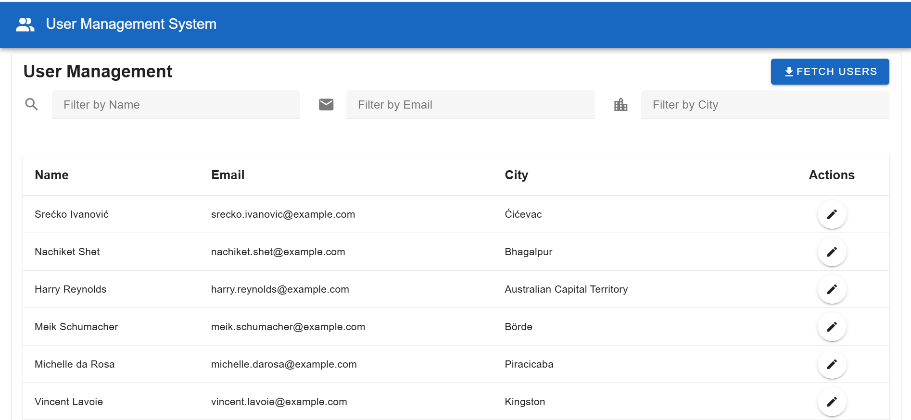
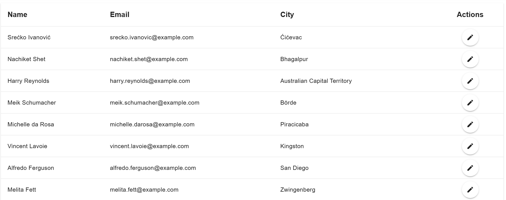
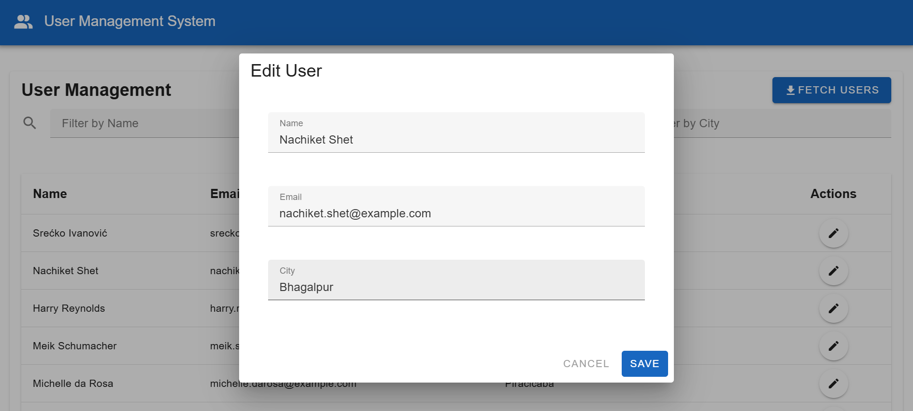
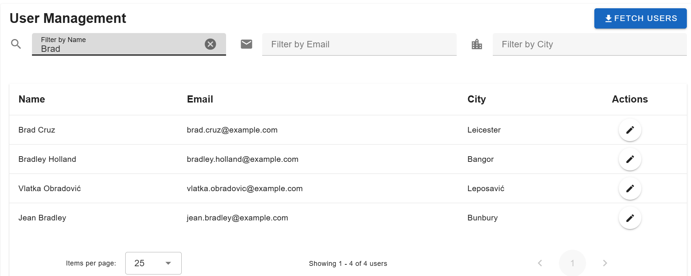

# 📘 Fullstack User Management System  

A full-stack user management application built using **Vue.js**, **Vuetify**, **Node.js**, and **MySQL**.

This system fetches random users from a public API, stores them in a database, displays them in a Vuetify data table, and supports editing, filtering, and pagination.

---

## 📸 Project Overview

### 🏠 Home / Dashboard


---
### 📄 Users Table


---
### ✏️ Edit User Modal


---
### ⏳ Fetch Users Action


---

## 🚀 Features

### 🔹 Backend (Node.js + Express + MySQL)
- Fetches **1000 random users** from RandomUser API
- Extracted fields:
  - Full Name  
  - Email  
  - City  
  - UUID (unique identifier)
- REST API Endpoints:
  - `POST /api/users/fetch` – Insert 1000 users into the DB  
  - `GET /api/users` – List users (pagination + filters)  
  - `PUT /api/users/:uuid` – Update user details  
- Clean folder structure (controllers, models, routes)
- `.env` environment configuration  
- Efficient SQL pagination (`LIMIT + OFFSET`)

---

### 🔹 Frontend (Vue.js + Vuetify)
- Beautiful **Vuetify v-data-table**
- Pagination with:
  - 25 rows per page (default)
  - 10 / 25 / 50 / 100 rows options
- Advanced Filters:
  - Name  
  - Email  
  - City  
- Debounced search (for performance)
- Edit User Modal with form validation
- Skeleton loading states
- Snackbar notifications
- Auto-scroll on pagination
- Clean Material Design UI

---

## 📊 Pagination Overview

- Total users stored: **1000**
- Default rows per page: **25**
- Total pages: **40**
```
Page 1 → Users 1–25
Page 2 → Users 26–50
...
Page 40 → Users 976–1000
```

---

## 📂 Project Structure
```
User-Management/
│
├── backend/
│ ├── config/ # DB connection
│ ├── controllers/ # Route logic
│ ├── models/ # SQL queries
│ ├── routes/ # API endpoints
│ ├── .env
│ ├── server.js
│ └── package.json
│
├── frontend/
│ ├── src/
│ │ ├── components/ # Vue components
│ │ ├── services/ # Axios API service
│ │ ├── plugins/ # Vuetify configuration
│ │ ├── App.vue
│ │ └── main.js
│ ├── index.html
│ └── package.json
│
└── README.md
```

---

## 🔗 API Summary

| Method | Endpoint | Description |
|--------|----------|-------------|
| `POST` | `/api/users/fetch` | Fetch and store 1000 users |
| `GET`  | `/api/users` | Get paginated + filtered users |
| `PUT`  | `/api/users/:uuid` | Update user (name, email, city) |

---

## 🛠 Tech Stack

### Frontend
- Vue.js 3  
- Vuetify 3  
- Axios  

### Backend
- Node.js  
- Express  
- MySQL  

---
## 📦 Installation & Setup Guide

Follow these steps to run the project locally 👇

### 1️⃣ Clone this repository
```
git clone https://github.com/leonrock128/User-Management.git
cd User-Management
```

### 2️⃣ Install Backend Dependencies
```
cd backend
npm install
```

### 3️⃣ Create Backend .env File
Inside the backend folder:

touch .env

Add the following variables:
```
DB_HOST=localhost
DB_USER=root
DB_PASSWORD=your_password
DB_NAME=user_management
PORT=5000
```

### 4️⃣ Run the Backend Server
```
node server.js
```
Backend will run at:

👉 http://localhost:5000

### 5️⃣ Install Frontend Dependencies

Open a new terminal and run:
```
cd frontend
npm install
```
### 6️⃣ Create Frontend .env File

Inside the frontend directory:

touch .env

Add:

VITE_API_BASE=http://localhost:5000/api

### 7️⃣ Run the Frontend
```
npm run dev
```

Frontend will run at:

👉 http://localhost:5173

### 🟢 Project is Now Running!

Backend → http://localhost:5000

Frontend → http://localhost:5173

Vue UI will fetch users from your Node.js API

---

## ✨ Extra Features
✔ Items-per-page saved in local storage

✔ Debounced filter text fields

✔ Clean modal UI for editing

✔ Error & success toast messages

✔ Professional folder organization

✔ Reusable services for API calls

✔ Responsive layout using Vuetify Grid

## 🧪 Future Enhancements
Delete user

Export table to CSV

Sorting (Name, Email, City)

Dark / Light mode switch

JWT User Authentication

Role-based permissions

## 🤝 Contributing
Pull requests are welcome!
For major changes, please open an issue first.
